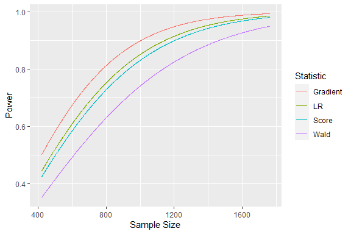

<!-- README.md is generated from README.Rmd. Please edit that file -->

# irtpwr

<!-- badges: start -->

[](https://github.com/flxzimmer/irtpwr/actions/workflows/R-CMD-check.yaml)
<!-- badges: end -->

This package offers implementation of analytical and sampling-based
power analyses for the Wald, LR, score, and gradient tests in the
frameworks of linear hypotheses and marginal maximum likelihood
estimation. The methods are described in our paper (Zimmer et
al. (2022), <https://doi.org/10.1007/s11336-022-09883-5>).

## Installation

You can install the CRAN version using:

``` r
install.packages("irtpwr")
```

Or, you can install the development version of irtpwr from
[GitHub](https://github.com/) with:

``` r
# install.packages('devtools')
devtools::install_github("flxzimmer/irtpwr", build_vignettes = TRUE)
```

## Toy example

We can load the irtpwr package using:

``` r
library(irtpwr)
library(mirt)
#> Loading required package: stats4
#> Loading required package: lattice
```

We want to know the power and the required sample size for a test of the
Rasch vs 2PL model. We use the LSAT 7 data set which is included the
mirt package.

As a first step, we load the data set and fit a 2PL model.

``` r
dat <- expand.table(LSAT7)
mirtfit <- mirt(dat, 1, verbose = FALSE)
```

The 2PL parameters are then used as parameters for the alternative
hypothesis in our hypothesis definition.

``` r
hyp <- setup.hypothesis(type = "1PLvs2PL", altpars = mirtfit)
```

We can now perform the power analysis. We want to determine the sample
size necessary for a power of .8 while using an alpha level of .05.

``` r
res <- irtpwr(hyp = hyp, power = 0.8, alpha = 0.05)
summary(res)
#> 
#>  Sample sizes for power = 0.8 (alpha = 0.05): 
#> 
#>  Statistic    N
#>       Wald 1134
#>         LR  887
#>      Score  932
#>   Gradient  778
#> 
#> Method: Analytical
```

Here we see that the gradient statistic would be the most efficient to
test our hypothesis: We would need a sample size of 778 to reach our
desired power.

We can also plot the power curves to get a more detailed look on the
relationships between sample size and power:

``` r
plot(res)
```



## Further documentation

Further documentation on how to use the package is found in the package
vignettes:

- The vignette “demo” gives a short introduction of basic features,
- “power_analysis” gives a more thorough walkthrough of power analysis
  with irtpwr,
- “adding_hypotheses” gives a tutorial on setting up custom hypotheses,
- “hypothesis_templates” includes some templates for hypothesis objects
  that can be altered for your specific use case.

If the vignettes were included during installation (for example using
the methods above), they can be accessed via:

``` r
browsevignettes("irtpwr")
```
